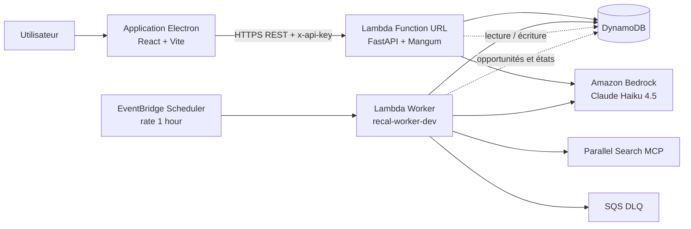

# Recal

> **L’agent personnel de veille qui transforme la recherche d’opportunités en résultats pertinents.**

[](https://github.com/OWNER/REPO/actions/workflows/ci.yml)
[](LICENSE)

## Live Links

- Donwload a file: https://github.com/HE11032006/Recal/releases/download/V0.1.0/Recal.Setup.0.1.0.exe
- GitHub repository: https://github.com/HE11032006/Recal
- Video demo: https://youtu.be/ffkz4I85D6g

## Description

Recal est un agent autonome de veille destiné aux étudiants et aux jeunes diplômés. Il surveille les hackathons, stages, fellowships, bourses, conférences et certifications afin de faire ressortir uniquement les opportunités qui correspondent réellement au profil de l’utilisateur.

Les opportunités sont recherchées sur le web, analysées avec Claude Haiku 4.5 via Amazon Bedrock, filtrées selon le profil, scorées de manière explicable, dédupliquées puis persistées dans DynamoDB. Une application Electron permet ensuite de consulter les résultats, de les sauvegarder, de les refuser et de recevoir des notifications.

## Le problème

Les opportunités destinées aux étudiants sont dispersées sur de nombreux sites, publiées à des formats différents et souvent découvertes trop tard. Une recherche manuelle régulière est chronophage et produit beaucoup de bruit : résultats hors profil, doublons, agrégateurs peu utiles et échéances difficiles à suivre.

## Pour qui ?

Recal s’adresse principalement aux étudiants, jeunes diplômés et candidats internationaux qui cherchent régulièrement des opportunités académiques ou professionnelles, notamment des utilisateurs qui souhaitent suivre plusieurs catégories et plusieurs pays sans effectuer eux-mêmes une veille quotidienne.

## Pourquoi c’est important

Une opportunité pertinente peut être manquée simplement parce qu’elle est publiée sur une source inconnue ou noyée parmi des dizaines de résultats. Recal réduit le temps de recherche, rend les critères de sélection visibles et aide l’utilisateur à se concentrer sur les candidatures réellement accessibles.

## Fonctionnalités principales

- Veille automatique planifiée par EventBridge Scheduler.
- Recherche web via Parallel Search MCP, avec Tavily disponible en fallback.
- Analyse structurée par Claude Haiku 4.5 via Amazon Bedrock.
- Score de pertinence explicable et filtrage par profil.
- Déduplication des URLs et persistance DynamoDB.
- Catégories : hackathons, stages, fellowships, bourses, conférences et certifications.
- Configuration du profil, des domaines, des pays et des préférences de veille.
- Application Electron avec vues Aujourd’hui, Sauvegardés et Profil.
- Notifications, cache local et mode hors-ligne.
- Interface française et anglaise, thème clair et sombre.
- API FastAPI versionnée sous `/api/v1` et protégée par `x-api-key` lorsqu’elle est déployée.

## Architecture



Le flux principal est : **déclenchement planifié → recherche → analyse Claude → filtrage et scoring → déduplication → DynamoDB → affichage Electron → notification utilisateur**.

La source éditable du diagramme est disponible dans [`architecture.mmd`](architecture.mmd).

## Technologies

| Couche | Technologies |
|---|---|
| Desktop | Electron, React, Vite, TypeScript, Tailwind CSS |
| API | Python 3.11+, FastAPI, Pydantic, Mangum |
| Agent | Strands Agents, Amazon Bedrock, Claude Haiku 4.5 |
| Recherche | Parallel Search MCP, Tavily en fallback optionnel |
| Cloud | AWS Lambda, EventBridge Scheduler, DynamoDB, SQS |
| Qualité | Pytest, Ruff, Mypy, pip-audit, Gitleaks, GitHub Actions |

## Structure du dépôt

```text
Recal/
├── backend/                 # API, domaine, cas d’utilisation et worker
├── frontend/                # Application Electron React
├── contracts/               # Contrat OpenAPI
├── infra/                   # Template AWS SAM
├── scripts/                 # Scripts de cycle local et outils
├── architecture.mmd        # Diagramme d’architecture Mermaid
├── project.md               # Vision et architecture cible
├── progress.md              # Suivi d’avancement
├── security.md              # Registre de sécurité
├── VIDEO_SCRIPT.md          # Script de démonstration
├── LICENSE                  # Licence MIT
└── README.md
```

## Prérequis

- Python 3.11 ou supérieur.
- Node.js 20 ou supérieur et npm.
- Un compte AWS configuré avec les permissions nécessaires si Bedrock et DynamoDB sont utilisés.
- Docker Desktop pour le build SAM sous Windows.
- Accès au modèle Claude Haiku 4.5 dans la région `us-east-1`.

## Installation locale

### Backend

```bash
git clone https://github.com/HE11032006/Recal
cd Recal
python -m venv .venv
# Windows PowerShell
.\.venv\Scripts\Activate.ps1
# macOS / Linux : source .venv/bin/activate
python -m pip install --upgrade pip
python -m pip install -e "./backend[dev,agent,search]"
copy backend/.env.example backend/.env  # Windows
# cp backend/.env.example backend/.env    # macOS / Linux
```

Pour un cycle local sans AWS, utiliser `ANALYZER_PROVIDER=fake` et la configuration de persistance locale prévue par le projet. Pour une analyse réelle, utiliser `ANALYZER_PROVIDER=strands` et un profil AWS autorisé à invoquer Bedrock. Ne jamais placer de clé AWS, de clé Tavily ou de clé API réelle dans Git.

### Frontend Electron

```bash
cd frontend
npm install
npm run build
npm run electron:dev
```

Pour configurer l’API cloud du frontend, définir `VITE_API_BASE_URL` et, si nécessaire, `VITE_API_KEY` dans l’environnement de build. La clé API ne doit jamais être commitée dans le dépôt.

## Tests et qualité

Depuis la racine du dépôt :

```bash
python -m pip install -e "./backend[dev,agent,search]"
cd backend
python -m compileall -q src
python -m pytest -q
ruff check src tests
ruff format --check src tests
mypy src
pip-audit --local
```

Le workflow GitHub Actions vérifie également les tests, le formatage, les types, les dépendances et les secrets.

## Déploiement AWS

Le déploiement utilise AWS SAM. Depuis la racine du dépôt :

```bash
sam build --use-container --template infra/template.yaml
sam deploy --stack-name recal-dev --resolve-s3 --capabilities CAPABILITY_IAM
```

Le template crée notamment :

- le worker Lambda de veille ;
- l’API Lambda exposée par Function URL ;
- quatre tables DynamoDB ;
- le Scheduler EventBridge ;
- la file SQS de dead-letter ;
- les politiques IAM limitées aux ressources Recal et au modèle Bedrock cible.

Pour une API publique, fournir `ApiKey` comme paramètre SAM via un mécanisme sécurisé. Une API sans clé est réservée au développement contrôlé. Vérifier les sorties CloudFormation pour récupérer l’URL de l’API.

## Sécurité

Le frontend ne contient aucune clé AWS, Bedrock ou Tavily. Le backend valide les payloads, applique les règles métier, protège l’API par clé lorsque la variable `API_KEY` est configurée et ne renvoie pas de stack trace ni de secret. Les détails supplémentaires sont documentés dans [`security.md`](security.md).

Avant toute publication, vérifier l’absence de secrets avec le scan CI et remplacer `OWNER/REPO` par l’URL publique réelle du dépôt.

## Démonstration

Le script de démonstration de moins de cinq minutes est disponible dans [`VIDEO_SCRIPT.md`](VIDEO_SCRIPT.md). La vidéo doit montrer l’application Electron, une opportunité détaillée, la sauvegarde ou le refus d’une opportunité, le profil de veille et, si possible, le cycle AWS ou les données persistées.

- **Dépôt public :** `https://github.com/HE11032006/Recal`
- **Démo live / API :** à renseigner après publication
- **Vidéo :** à renseigner après enregistrement
- **AWS Builder ID :** à renseigner dans le formulaire de soumission

## Limites connues

La qualité des résultats dépend des pages accessibles et de la variabilité de la recherche web. Le frontend Electron consomme actuellement une API locale ou une API cloud selon la configuration. L’authentification utilisateur complète et l’autorisation par ressource restent des évolutions prévues pour une version multi-utilisateur.

## Licence

Recal est distribué sous licence MIT. Voir [`LICENSE`](LICENSE).
